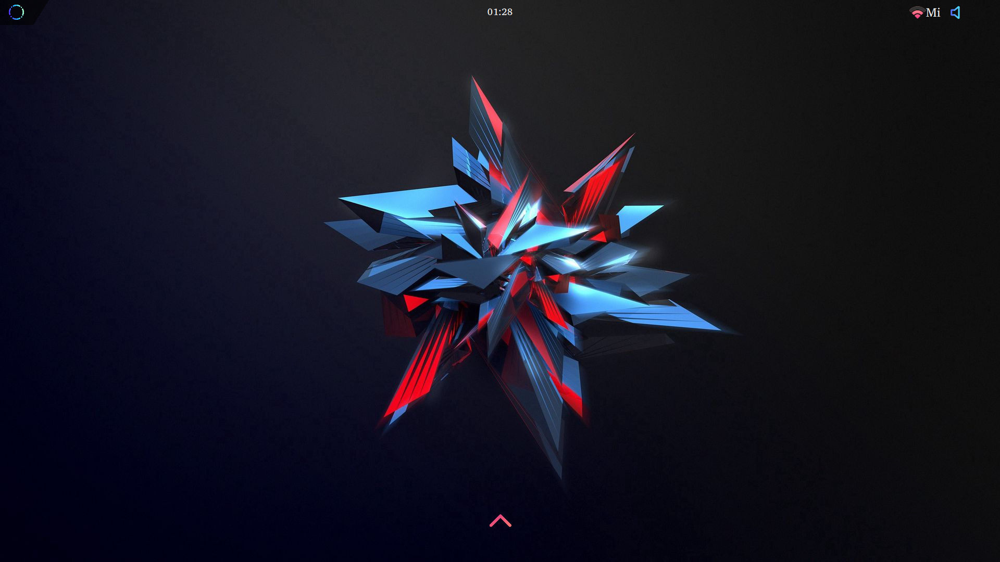
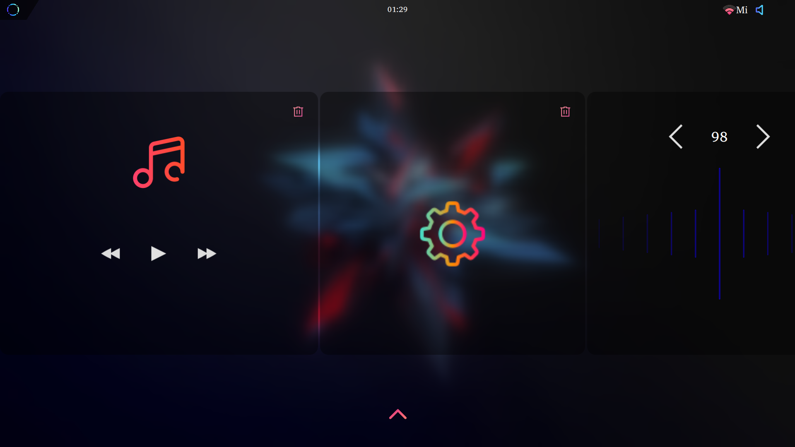

    

# KOS

 

 

Minimal and lightweight os based on Linux Buildroot for raspberry pi 3 written entirely with Qt/QML

    

    

    

## Features

- Notifications
- Interactive tray icons
- Fully customizable themes - currently there is only one
   * Real-time theme configuration
- Hardware acceleration
- Fast and responsive UI
- Vast variety of video/audio codecs - thanks to GStreamer
- Bluetooth audio - Bluez
- Wifi connection - Connman
- Quick boot time ~ 18 seconds

## Requirements
- Raspberry pi 3 64bit
- Touch screen display 
- 3.5 mm audio jack (audio does not work with hdmi)
- Cooling fan if you want to overclock

## Build
At the moment there is no package for Buildroot.

- NOTE

StyleManager, UsbUtils, FileCache and KEnvironment need to be run as root.\
FileCache needs to know where HOME folder is (HOME=/path/to/home FileCache).\
XDG_RUNTIME_DIR needs to be set or KEnvironment will fail.

## Future updates

- Audio cards switch
- FM-radio(currently in alpha)
- BMW IBUS app 
- Boot animation
- Brightness control.

## Credits

- [Candy-icons](https://github.com/EliverLara/candy-icons)
- [BeautyLine](https://github.com/gvolpe/BeautyLine)
- [Connman](https://github.com/ev3dev/connman)
- [GSteamer](https://github.com/GStreamer/gstreamer)

[//]: # (These are reference links used in the body of this note and get stripped out when the markdown processor does its job. There is no need to format nicely because it shouldn't be seen. Thanks SO - http://stackoverflow.com/questions/4823468/store-comments-in-markdown-syntax)

   [dill]: <https://github.com/joemccann/dillinger>
   [git-repo-url]: <https://github.com/joemccann/dillinger.git>
   [john gruber]: <http://daringfireball.net>
   [df1]: <http://daringfireball.net/projects/markdown/>
   [markdown-it]: <https://github.com/markdown-it/markdown-it>
   [Ace Editor]: <http://ace.ajax.org>
   [node.js]: <http://nodejs.org>
   [Twitter Bootstrap]: <http://twitter.github.com/bootstrap/>
   [jQuery]: <http://jquery.com>
   [@tjholowaychuk]: <http://twitter.com/tjholowaychuk>
   [express]: <http://expressjs.com>
   [AngularJS]: <http://angularjs.org>
   [Gulp]: <http://gulpjs.com>

   [PlDb]: <https://github.com/joemccann/dillinger/tree/master/plugins/dropbox/README.md>
   [PlGh]: <https://github.com/joemccann/dillinger/tree/master/plugins/github/README.md>
   [PlGd]: <https://github.com/joemccann/dillinger/tree/master/plugins/googledrive/README.md>
   [PlOd]: <https://github.com/joemccann/dillinger/tree/master/plugins/onedrive/README.md>
   [PlMe]: <https://github.com/joemccann/dillinger/tree/master/plugins/medium/README.md>
   [PlGa]: <https://github.com/RahulHP/dillinger/blob/master/plugins/googleanalytics/README.md>
